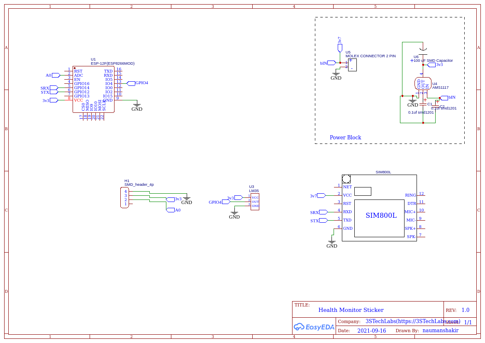

<p align="center">
  <a href="" rel="noopener">
 </a>
</p>

<h3 align="center">Smart Health Monitor</h3>

<div align="center">

[]()


</div>

---


<p align="center"> Smart Health Monitor
    <br> 
</p>

## 📝 Table of Contents

- [About](#about)
- [Getting Started](#getting_started)
- [RPiClient Installation](#Installation)
- [Circuit](#circuit)
- [Usage](#usage)
- [Built Using](#built_using)
- [Authors](#authors)


## 🧐 About <a name = "about"></a>

This repo contains

- Firmware
- Circuit Diagram
- PCB Files
- Detailed instructions

for Smart Health Monitor project.


## Getting Started <a name = "getting_started"></a>

These instructions will get you a copy of the project up and running on your system.


### Prerequisites

Things you need to install the FW.

```
- Arduino IDE
```

### Installing <a name = "installing"></a>

A step by step series that tell you how to get the Firmware and Backend running

#### ESP32 Configuration

You should have Arduino IDE Installed

  1.  Add ESP8266 Board to your Arduino IDE
    1. In your Arduino IDE, go to File> Preferences
        Installing ESP8266 Add-on in Arduino IDE Windows, Mac OS X, Linux open preferences
    2. Enter ```http://arduino.esp8266.com/stable/package_esp8266com_index.json``` 
        into the “Additional Board Manager URLs” field then, click the “OK” button:
        Note: if you already have the ESP8266 boards URL, you can separate the URLs with a comma(each board will go to neaw line) as follows:
        ```https://dl.espressif.com/dl/package_esp32_index.json,\n http://arduino.esp8266.com/stable/package_esp8266com_index.json```
    
    
  2. Open the Boards Manager. Go to Tools > Board > Boards Manager…
  3. Search for ESP8266 and press install button for the ESP8266 by Espressif Systems“:
  4. That’s it. It should be installed after a few seconds.
  5.  Close and re-open the Arduino IDE.

  6.  Now copy the contents of the libs folder to the libraries directory of your Arduino
      1. If you are using windows, the libraries directory will be Documents/Arduino/libraries

##### ESP8266 Node FW Uploading
  1.  Select ESP32 Dev Module from Tools->Board->ESP8266
  2.  Select the correct port from Tools->Port
  3.  Then open Firmware.ino file,
  4.  Now Upload the Code to your NodeMCU 1.0(ESP-12E Module).
  5.  Your ESP8266 is now ready to be used.


## Circuit <a name = "circuit"></a>


### ESP8266 Dev Module Pinout


Follow the pinout diagram given below to connect different components to your ESP8266 Module.


### Other Components

```http
Other components pin connection details
```


#### Temperature Sensor LM35

```LM35 Connections```

| LM35 Pins | ESP8266 Module Pins| 
| :--- | :--- | 
| `OUT` | `IO4` |
| `VCC` | `3.3V` |
| `GND` | `GND` | 

#### Pulse Sensor

```Pulse Sensor Connections```

| Pulse Sensor Pins | ESP8266 Module Pins| 
| :--- | :--- | 
| `3.3V` | `3.3V` |
| `GND` | `GND` |
| `DATA` | `A0` |

#### GPRS Module

```SIM800L Connections```

| SIM800L Pins | ESP8266 Module Pins| 
| :--- | :--- | 
| `VCC` | `3.7V` |
| `GND` | `GND` |
| `RXD` | `GPIO14` |
| `TXD` | `GPIO12` |


### Complete Schematics

Here's the complete circuit diagram of the system.



## Usage <a name = "usage"></a>


## List of Components <a name = "list"></a>

-   BOM is available in Circuit/PCB/BOM_SmartHealthMonitor_2021-09-16.csv of this repository


## ⛏️ Built Using <a name = "built_using"></a>

- [Python](https://www.python.org/) - For Cloud Gateway Pogramming
- [Arduino](https://www.arduino.cc/) - Embedded Framework and IDE - For Sensor Node Design


## ✍️ Authors <a name = "authors"></a>

- [@Nauman3S](https://github.com/Nauman3S) - Development and Deployment
